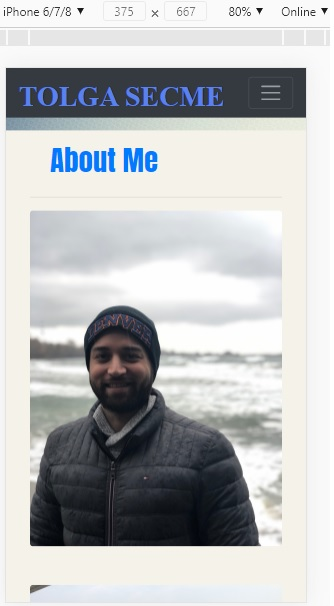
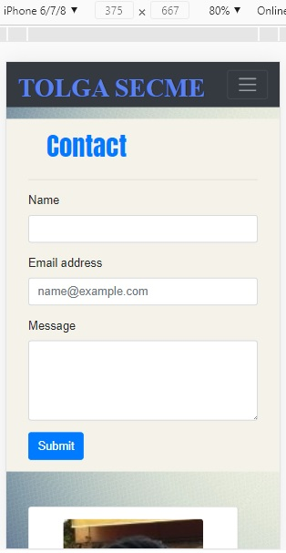
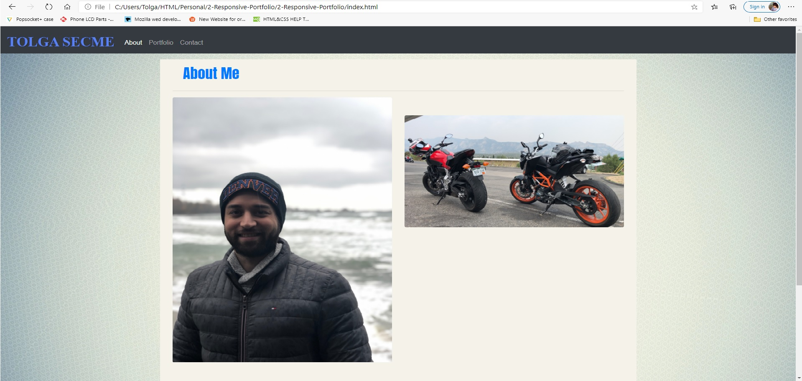
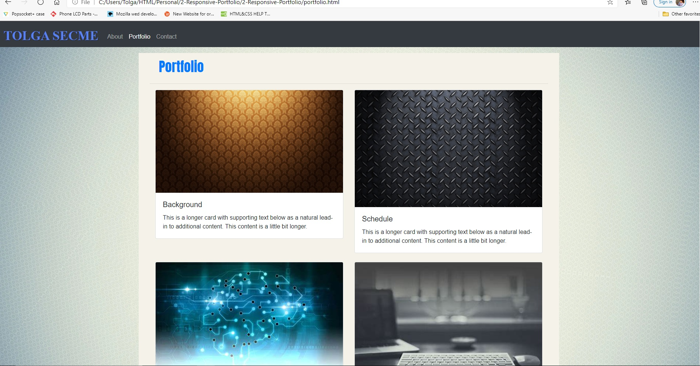
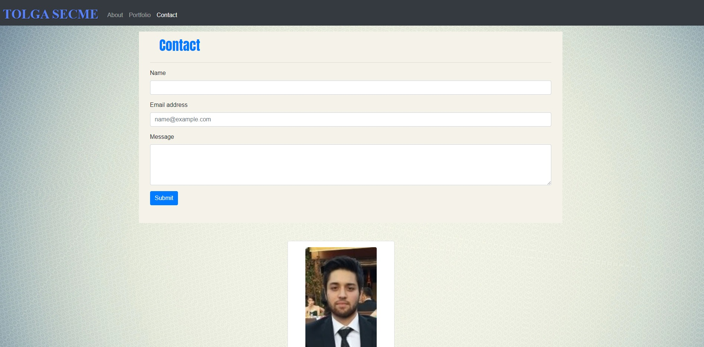
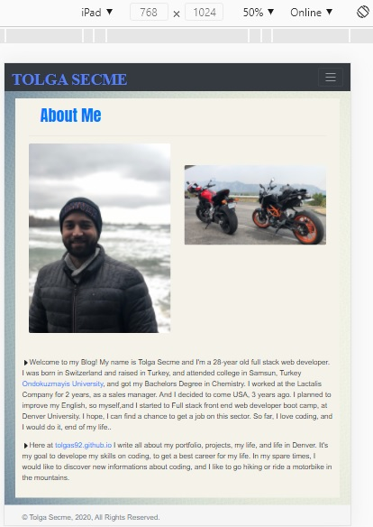
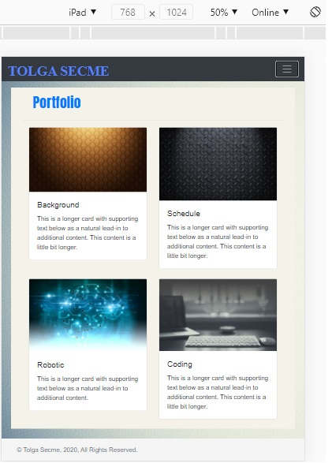
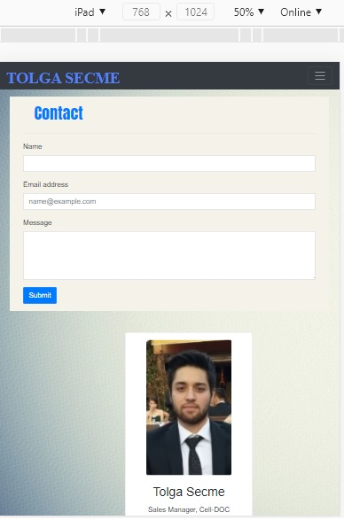
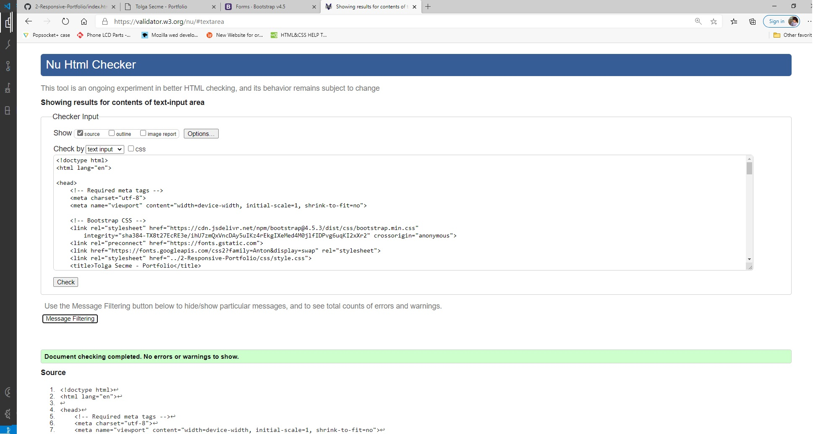

# My Portfolio

## Libraries
1. Bootstrap
2. Google Fonts
3. Jquery

## About
- The purpose of this page to show my portfolio, and what I have done so far with my coding skills, also making the digital resume.

## What I learned
- How to make responsive page? (mobile/tablet/Desktop)
- How to link different pages? (index/portfolio/contact)
- How to use Bootstrap..
- How to make grid system on my page..
## ScreenShots

# Mobile
- 
- 
- 

# Desktop
- 
- 
- 

# Tablet
- 
- 
- 

# HTML validator

- 

## Link
1. [github.io](https://tolgas92.github.io/2-Responsive-Portfolio/)
2. [github](https://github.com/TolgaS92/2-Responsive-Portfolio)