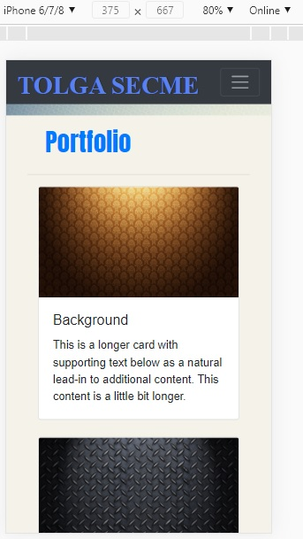

# My Portfolio

## Libraries
Bootstrap
Google Fonts
Jquery

## About
The purpose of this page to show my portfolio, and what I have done so far, and to make digital resume.

## What I learned
How to make responsive page? (mobile/tablet/Desktop)
How to link different pages? (index/portfolio/contact)
How to use Bootstrap..
How to make grid system on my page..
## ScreenShots

# Mobile

# Desktop

# Tablet

# HTML validator

## Link
[github.io](https://tolgas92.github.io/2-Responsive-Portfolio/)
[github](https://github.com/TolgaS92/2-Responsive-Portfolio)